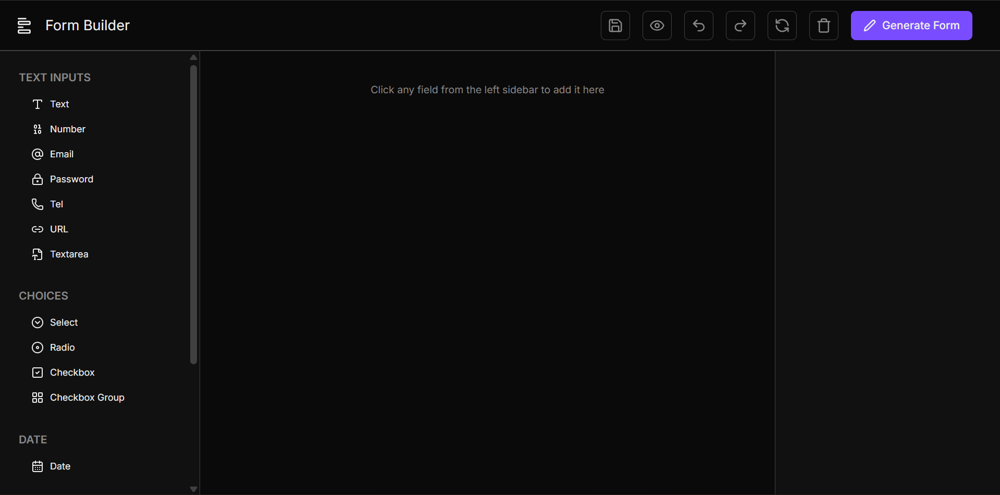
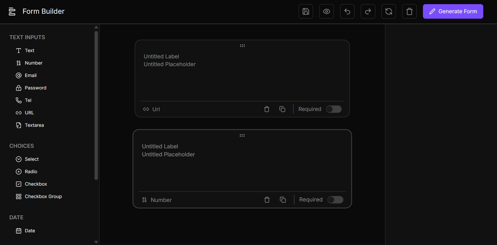

# Form Builder

Form Builder is an advanced, visual drag-and-drop utility designed specifically for developers. It provides a graphical interface to quickly design and construct complex form structures. As you build, the application instantly generates production-ready **React Hook Form** code combined with robust **Zod** validation schemas. The generated output is designed to be pasted directly into any React application, drastically reducing development time on boilerplate form setup.

---

## Features

- **Visual Form Canvas**: A highly interactive, strictly typed drag-and-drop workspace using `@dnd-kit`.
- **Real-Time Code Generation**: Instantly produces valid React Hook Form markup (`useForm`, `<Controller>`, `register` calls).
- **Zod Schema Generation**: Automatically infers and constructs Zod validation schemas based on field types, validations (e.g., max length, patterns), and required states.
- **Comprehensive Field Types**:
  - **Text Inputs**: Plain text, email, password, number, tel, and URL.
  - **Selection Controls**: Select dropdowns, Radio groups, Checkboxes (single & group), and Toggle Switches.
  - **Advanced Inputs**: Textareas, Date pickers, File uploads, and Range sliders.
- **Granular Customization**: Define custom placeholders, default values, labels, and specific HTML attributes per field.
- **Robust State Management**: Powered by Zustand, with built-in Undo/Redo historical tracking provided by Zundo.

---

## Tech Stack

- **Framework**: [React 19](https://react.dev/) with [Vite](https://vitejs.dev/)
- **Language**: [TypeScript](https://www.typescriptlang.org/) (\~5.9.3)
- **Styling**: [Tailwind CSS 4](https://tailwindcss.com/)
- **State Management**: [Zustand](https://github.com/pmndrs/zustand)
- **Time Travel (Undo/Redo)**: [Zundo](https://github.com/charkour/zundo)
- **Drag & Drop**: [@dnd-kit](https://dndkit.com/)
- **UI Components**: [shadcn/ui](https://ui.shadcn.com/) (using Radix Primitives)
- **Icons**: [Lucide React](https://lucide.dev/)

---

## Getting Started

### Prerequisites

Ensure you have Node.js (v20+) installed. The project relies on recent Node and React features.

### Installation

1. **Clone the repository:**

   ```bash
   git clone <repository_url>
   cd form-generator
   ```

2. **Install dependencies:**

   ```bash
   npm install
   ```

3. **Start the development server:**

   ```bash
   npm run dev
   ```

4. **Build for production:**
   ```bash
   npm run build
   ```

---

## Project Structure

A breakdown of the project directories to help you orient yourself:

```text
form-generator/
├── src/
│   ├── components/         # UI Elements & Canvas workspace
│   │   ├── FieldCanvas/    # Drag & Drop canvas cards
│   │   └── ui/             # shadcn/ui generic primitives
│   ├── constants/          # App constants & configurations
│   ├── hooks/              # Reusable React hooks
│   ├── lib/                # 3rd party configurations (Tailwind, Zod)
│   ├── pages/              # Top-level route components
│   ├── store/              # Zustand app state (form.store.ts)
│   ├── types/              # TS Schemas (field.ts, validations.ts)
│   └── utils/              # Helper functions
├── package.json            # Dependencies & Scripts
├── tailwind.config.ts      # Tailwind configuration
├── vite.config.ts          # Vite build configuration
└── README.md
```

- `/src/components` — Reusable, atomic UI elements. Contains the `FieldCanvas` module (handling individual draggable cards) and generic inputs.
- `/src/constants` — Application-wide constants, default configurations, and structural mappings.
- `/src/hooks` — Custom React hooks encapsulating specific logic (e.g., theme, focus management).
- `/src/lib` — Integrations and system configuration (e.g., Tailwind merge utilities, Shadcn setups).
- `/src/pages` — High-level route components and layout definitions.
- `/src/store` — Core application state. This relies on `form.store.ts` for schema modeling and history tracking.
- `/src/types` — Comprehensive TypeScript abstractions, primarily defining the `FieldSchema` discriminated unions for airtight type safety.
- `/src/utils` — Pure utility functions and formatters.

---

## Architecture & How It Works

At the heart of the Form Builder is an explicit separation between the **Visual Canvas** and the **Code Generator**, bridged entirely by a central Zustand state.

### 1. State Management (`FormStore`)

The application state manages an ordered array of `FieldSchema` objects. Each schema represents a discriminated union type (e.g., `TextField`, `SelectField`), making it impossible to represent an invalid state inside the store.

**Store Architecture**

```text
[ FormStore (Zustand) ]
 │
 ├── State
 │   ├── fields: FieldSchema[]      (The ordered list of fields on canvas)
 │   └── selectedId: string | null  (Currently focused field for editing)
 │
 ├── History (Zundo)
 │   ├── pastStates: FormStore[]    (Undo stack)
 │   └── futureStates: FormStore[]  (Redo stack)
 │
 └── Actions (Mutations)
     ├── addField()                 (Appends to bottom of canvas)
     ├── removeField()              (Deletes from canvas/clears focus)
     ├── updateField()              (Partial edits, e.g. change label)
     ├── reorderFields()            (Drag & drop sorting via splice)
     └── setSelectedField()         (Changes active property panel focus)
```

Mutations to this store are strictly controlled via actions. Partial updates use distributive omission to ensure that updating properties on a specific field subtype strictly respects TypeScript narrowed typing.

### 2. Data Model (`FieldSchema`)

The entire form state is represented by an array of uniquely identifiable field configurations. The model relies heavily on a discriminated union.

**Model Architecture**

```text
[ FieldSchema ] (Discriminated Union on 'type')
 │
 ├── type: 'text' (BaseTextField)
 │   ├── subtype: 'text'      (PlainTextField)
 │   ├── subtype: 'email'     (EmailTextField)
 │   ├── subtype: 'password'  (PasswordTextField)
 │   ├── subtype: 'number'    (NumberTextField)
 │   ├── subtype: 'tel'       (TelTextField)
 │   └── subtype: 'url'       (UrlTextField)
 │
 ├── type: 'textarea'         (TextareaField)
 ├── type: 'select'           (SelectField)
 ├── type: 'radio'            (RadioField)
 ├── type: 'checkbox'         (CheckboxField)
 ├── type: 'checkboxGroup'    (CheckboxGroupField)
 ├── type: 'date'             (DateField)
 ├── type: 'file'             (FileField)
 ├── type: 'range'            (RangeField)
 └── type: 'switch'           (SwitchField)

[ Base Properties shared across all variants ]
  » id: string           (UUID)
  » label: string        (Display string)
  » required: boolean    (Validation constraint)
```

### 3. Time Travel with Zundo

Because building complex forms is an iterative process, `zundo` wraps the Zustand store. It is configured to capture diffs of the `fields` array only.

```typescript
export const useFormStore = create<FormStore>()(
  temporal(createFormStore, {
    partialize: (state) => ({ fields: state.fields }),
  }),
);
```

This isolates the permanent schematic data from transient UI states (like `selectedId`), preventing an undo action from accidentally changing panel focus without reverting the schema.

### 4. Drag and Drop Interaction

The workspace (`FormCanvas`) mounts `@dnd-kit`'s context to enable vertical list sorting. As a `FieldCanvasCard` is dragged and dropped, the `onDragEnd` event resolves the old and new DOM indices and pipes them to `reorderFields` in the store:

```typescript
// Conceptual reordering approach
reorderFields: (fromIndex, toIndex) =>
  set((state) => {
    const newFields = [...state.fields];
    const [movedField] = newFields.splice(fromIndex, 1);
    newFields.splice(toIndex, 0, movedField);
    return { fields: newFields };
  });
```

### 5. Code Generation Engine

When the user requests the final code, the generator iterates over the `fields` array.

1. **Zod Generation:** Looks at the `FieldSchema.validations` and `required` boolean. It maps strings to `z.string()`, numbers to `z.coerce.number()`, and injects custom error messages.
2. **React Generation:** Constructs markup, wrapping inputs in `react-hook-form`'s `<Controller>` (for complex inputs like Select and Radio) or direct `register` passes for standard primitives.

### 6. Progress Screenshots

Form Builder Page UI :


Form Builder Page UI - Active Field :

