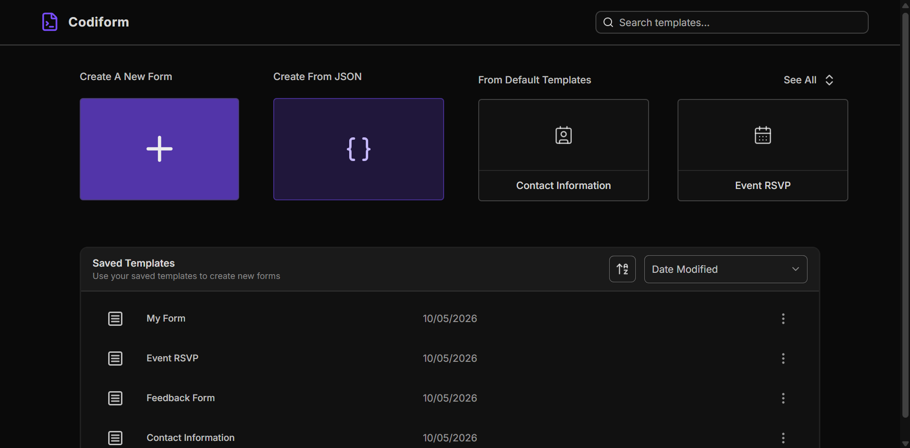
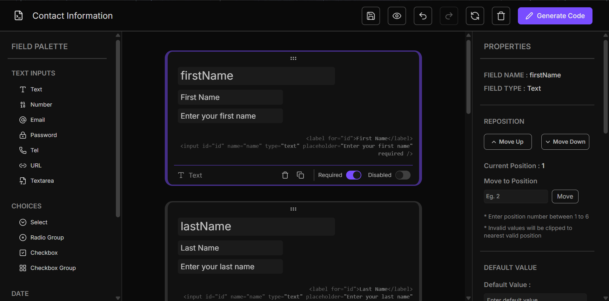
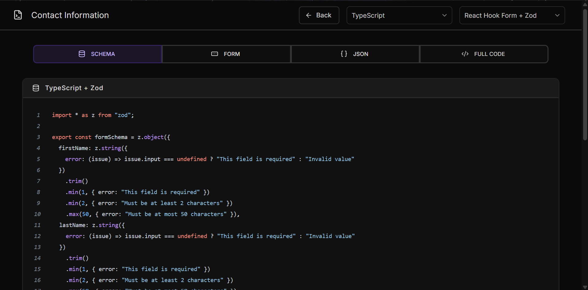
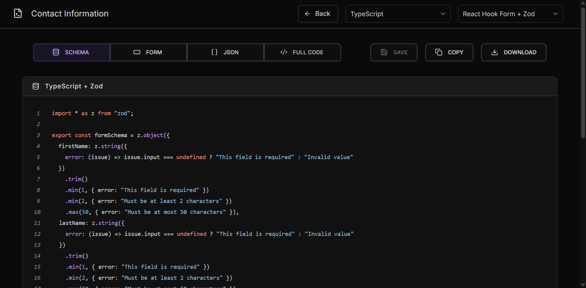
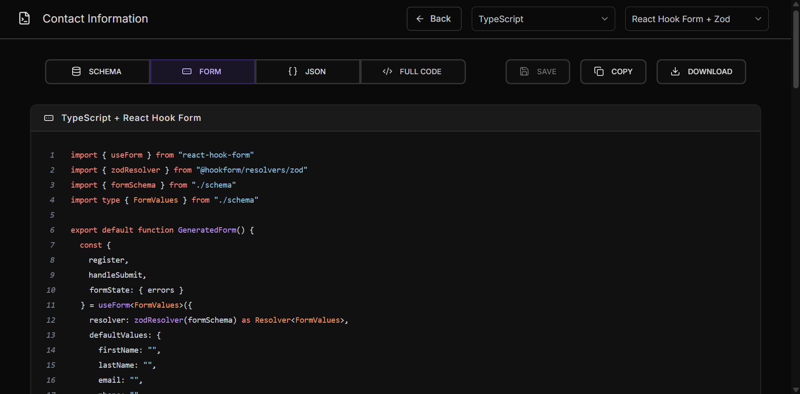
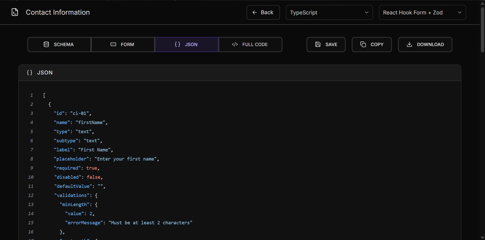
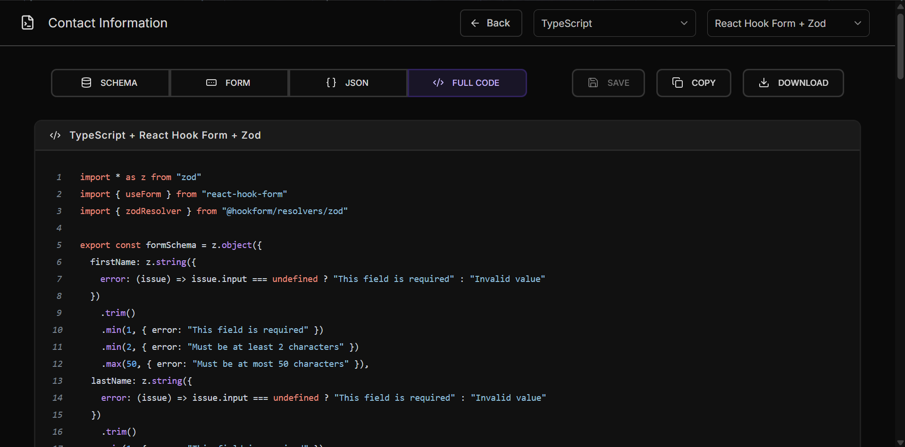
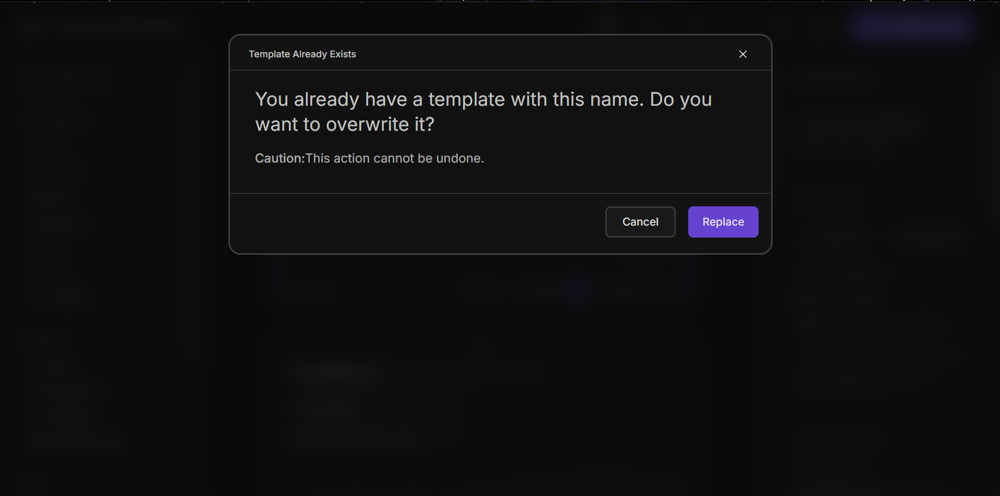
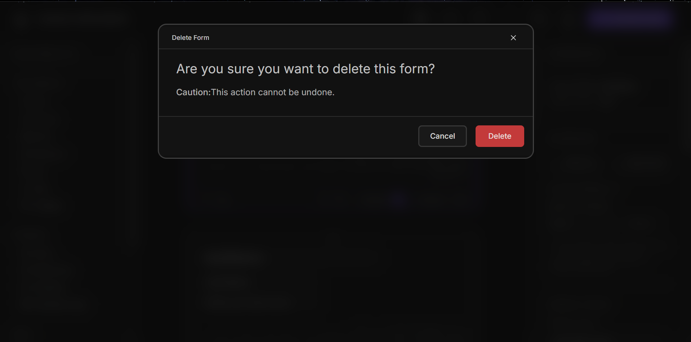

<div align="center">
  <h1>Codiform</h1>
  <p><strong>Build React forms visually. Generate production-ready code instantly.</strong></p>

  <p>
    
    
    
    
  </p>
</div>

<br />

<div align="center">
  <video src="./public/video/demo.mp4" poster="./public/screenshots/01-homepage.png" controls width="100%"></video>
  <p><em>Watch the demo of Codiform in action.</em></p>
</div>

---

Codiform is a visual form builder for React developers. Users drag and drop field types onto a canvas, configure validations and default values in a properties panel, and generate production-ready React form code with one click.

The generated output is ready to be pasted directly into any React application. This drastically reduces development time on boilerplate form setup.

## Screenshots

<div align="center">
  
  
  
  
  
  
  
  
  
</div>

## Features

### Builder
* **Visual Drag and Drop**: Highly interactive workspace powered by `@dnd-kit/react`.
* **Keyboard Navigation**: Move between canvas cards using arrow keys.
* **Undo/Redo**: Full history tracking (Ctrl+Z / Ctrl+Y) using `zundo`.
* **Properties Panel**: Configure fields precisely, with positional controls (move up/down, jump to position).
* **Ghost HTML Preview**: View the HTML structure of the field directly on each canvas card.
* **Editable Form Title**: Google Docs-style inline title editing.

### Code Generation
* **Multiple Output Formats**: Supports 6 different library combinations.
* **Language Toggle**: Output in TypeScript or plain JavaScript.
* **Syntax Highlighting**: Custom Palenight-inspired dark theme for code output using Prism.
* **One-Click Export**: Copy to clipboard and file download capabilities per tab.

### Templates
* **Save as Template**: Store reusable templates in `localStorage` with a replacement confirmation modal.
* **Predefined Templates**: 13 out-of-the-box templates covering Personal, Work, Education, Health, and E-commerce use cases.
* **JSON Import/Export**: Seamlessly transfer form schemas between environments.

### UX & Polish
* **Mobile/Tablet Landing Page**: Desktop blocker featuring a showcase for non-supported devices.
* **Toast Notifications**: Interactive and elegant feedback via `sonner`.

## Tech Stack

| Category | Technology |
| :--- | :--- |
| **Frontend** | React 19, TypeScript 5.9, Vite 7 |
| **Styling** | Tailwind CSS v4, shadcn/ui (Radix UI primitives) |
| **State Management** | Zustand 5 with `zundo` temporal middleware |
| **Routing** | React Router v7 |
| **Drag and Drop** | `@dnd-kit/react` (new API) |
| **Syntax Highlighting** | `react-syntax-highlighter` (Prism, custom theme) |
| **Icons & Typography** | `lucide-react`, Inter Variable, JetBrains Mono |
| **Components** | `sonner` (Toasts), shadcn/ui Calendar + Popover |
| **Target Libraries** | `react-hook-form`, `formik`, `zod`, `yup` |

## Field Types Supported

Codiform supports 15 distinct field types across various categories.

| Category | Field Type | Subtype / Options |
| :--- | :--- | :--- |
| **Text Inputs** | `text` | text, number, email, password, tel, url, textarea |
| **Choices** | `select` | Single and multiselect |
| | `radioGroup` | Options array |
| | `checkbox` | Single boolean |
| | `checkboxGroup` | Options array |
| **Other** | `date` | minDate, maxDate |
| | `file` | minSize, maxSize, acceptMimeTypes, acceptExtensions |
| | `range` | min, max, step |

Each field offers comprehensive configurations, including:
* Mapping to form library registers (e.g., RHF `register` name)
* Label and placeholder customization
* Required and disabled flags
* Type-specific validations with custom error messages (e.g., `minLength`, `maxLength`, regex patterns for text; `min`, `max`, `positive`, `integer` for numbers)
* Default value configuration

## Supported Output Combinations

| Library Combination | Schema Library | Language Support |
| :--- | :--- | :--- |
| React Hook Form | Zod | TypeScript, JavaScript |
| React Hook Form | Yup | TypeScript, JavaScript |
| Formik | Zod | TypeScript, JavaScript |
| Formik | Yup | TypeScript, JavaScript |
| None (Schema Only) | Zod | TypeScript, JavaScript |
| None (Schema Only) | Yup | TypeScript, JavaScript |

## Getting Started

### Prerequisites
* Node.js 18+
* npm or pnpm

### Installation

1. Clone the repository:
```bash
git clone https://github.com/PriyamSrivastava1507/form-builder.git
cd form-builder
```

2. Install dependencies:
```bash
npm install
```

3. Start the development server:
```bash
npm run dev
```

4. Build for production:
```bash
npm run build
```

## Project Structure

```text
src/
  assets/
  components/
    FieldCanvas/
      FieldCanvasCard/
        Body.tsx
        Handle.tsx
        Toolbar.tsx
        ConfirmDelete.tsx
        index.ts
      FieldCanvas.tsx
      index.ts
    FieldPalette/
      FieldPalette.tsx
      index.ts
    PropertyPane/
      sections/
        DefaultValueSection/
        ValidationSection/
        RepositionSection/
        OptionsSection/
      FieldPropertyPane.tsx
      index.ts
    MobileLanding/
      MobileLanding.tsx
    ui/
      Modal.tsx
      Switch.tsx
      (shadcn components)
  constants/
    fieldDefaults.ts
    fieldPalette.ts
    templates/
      index.ts
  generators/
    zodSchemaGenerators.ts
    yupSchemaGenerators.ts
    rhfGenerators.ts
    formikGenerators.ts
    colledDefault.ts
    schemaHelper.ts
    sanitizeName.ts
    generateCode.ts
  hooks/
    useDebounceCallback.ts
    useGeneratedCode.ts
  pages/
    FormRootPage.tsx
    FormBuilderPage.tsx
    FormOutputPage.tsx
    FormPreviewPage.tsx
    FormSeeAllTemplates.tsx
  store/
    form.store.ts
    output.store.ts
  types/
    field.ts
    fieldValidation.ts
    palette.ts
  layouts/
    RootLayout.tsx
  main.tsx
```

## Architecture Notes

* **Zustand with zundo**: We chose Zustand for its minimal boilerplate and direct state manipulation. Combining it with `zundo` provides undo/redo capabilities out of the box, which is essential for a visual builder.
* **Discriminated Union for FieldSchema**: Ensuring type safety across 15 distinct field types is challenging. A discriminated union allows the TypeScript compiler to statically verify that a `NumberField` cannot accidentally receive `maxLength` validation intended for a `TextField`.
* **Pure String Template Functions**: The code generator purposely avoids AST (Abstract Syntax Trees) or `eval()`. Instead, it uses pure string template functions. This makes the generation pipeline incredibly fast, highly predictable, and significantly easier to debug.
* **dnd-kit new API**: The application leverages the newer `@dnd-kit/react` API rather than `@dnd-kit/core`. This optimizes for modern React paradigms and provides a smoother drag-and-drop experience.
* **Desktop Only**: The interface relies on a multi-panel layout and complex drag-and-drop interactions that are fundamentally unsuited for mobile touchscreens. We enforce a desktop-only view to maintain a high-quality developer experience.

## Code Generation Architecture

The code generator follows a strict, predictable pipeline:

```text
[Field Configs]
      │
      ▼
[sanitizeName]
      │
      ▼
[Schema Template Functions]  <-->  [Form Template Functions]
      │                                    │
      ▼                                    ▼
[collectDefaultValues]             [Field Components]
      │                                    │
      └───────────────┬────────────────────┘
                      ▼
               [generateCode]
                      │
                      ▼
                [Output Tabs]
```

1. **Field Configs**: The raw Zustand state array.
2. **sanitizeName**: Ensures all field names map to valid JavaScript variable names.
3. **Schema / Form Templates**: Generates the validation schemas and JSX markup concurrently based on the target libraries.
4. **collectDefaultValues**: Extracts the specified defaults into a single object for form initialization.
5. **generateCode**: Assembles the imports, schema, interfaces, form setup, and return JSX into a final, formatted string.
6. **Output Tabs**: Renders the generated code into syntax-highlighted views.

## Roadmap

* [x] Formik + Zod output
* [x] Formik + Yup output
* [ ] Live preview of the actual form
* [ ] More field types
* [ ] Multi-step form support
* [ ] Cloud sync
* [ ] VS Code extension

## Contributing

Contributions are welcome!

1. Fork the Project
2. Create your Feature Branch (`git checkout -b feature/AmazingFeature`)
3. Commit your Changes (`git commit -m 'Add some AmazingFeature'`)
4. Push to the Branch (`git push origin feature/AmazingFeature`)
5. Open a Pull Request

## License

Distributed under the MIT License.

## Author

**Priyam Srivastava**
* GitHub: [@PriyamSrivastava1507](https://github.com/PriyamSrivastava1507)
* LinkedIn: [Priyam Srivastava](#)
